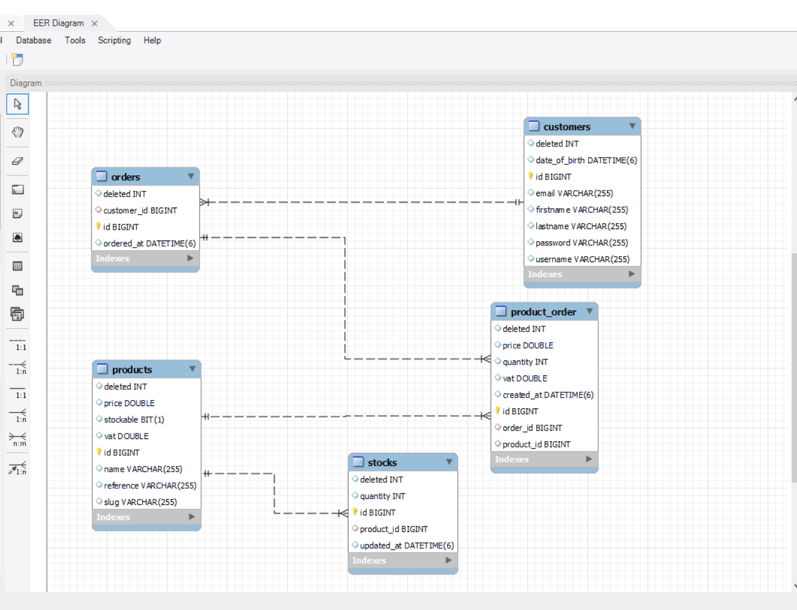

# order_management_system
This project aims to design and implement a backend application for order management. The application will provide a set of APIs to manage various entities related to order management. This README file provides instructions on how to build the application, create and run the Docker image, and other relevant information.

# Java Development Kit (JDK) version 8 or higher
Docker


Clone the project repository from GitHub:

bash
Copy code
git clone https://github.com/AhmadAbuAwwad/order_management_system.git

Creating and Running the Docker Image
To create and run the Docker image of the application, follow these steps:

Build the Docker image using the provided Dockerfile:
To build the application, follow these steps:

```chmod 777 runner.sh```

```./runner.sh```

# API Documentation
The API documentation is generated using Swagger. To access the Swagger documentation, open a web browser and navigate to http://localhost:8080/swagger-ui.html after running the application.

# Postman Collection
The Postman collection for testing the APIs is available in the repository. To import the collection into Postman

Select the downloaded Postman collection file ([order-management-system.postman_collection.json](src%2Fmain%2Fresources%2Forder-management-system.postman_collection.json)).
The collection will be imported, and you can now use it to test the APIs.

# Entity Relations


# Security and Authentication
JWT for securing APIs

# Contributing
Ahmad Abu Awwad

# License
Fesh